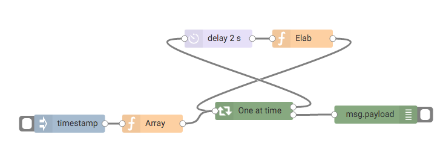

Node-red Serial Iterator
========================

Install
-------

Run the following command in the root directory of your Node-RED install

    npm install node-red-contrib-serial-iterator

## Overview

Iterate over an Array received on the input, giving the next element only after it receives a feedback.

## Serial Iterator

This node have 1 input and 2 outputs, the upper output is where is sent each element of the Array, the lower output is where is sent the output after all elements of the Array are processed.

Every element of the Array is sent as payload.

The node have the following properties :

### Iterate over msg.

Is the property that contains the Array that you want to iterate, you can use a dot for access to deeper properties
Example :

    payload.response.items

### Pass always the message properties from the input

While the node is iterating over the Array he preserve the values of the properties that aren't payload. Checking this radio you are saying to the node to use the properties received from the input.

An Example of a possible user case is :
The input is a collection of ids of Facebook pages stored in msg.payload, and on msg.credentials are stored access_token, client_id and other properties.

Having the properties preserved, for each iteration whatever is the output message from the feedback, the credentials are always available.

### Pass always the message properties from the feedback

Checking this radio you are saying to the node to use the properties received from the feedback.
For the first iteration the properties passed as output are the input properties.

An Example of a possible user case is :
The input is a collection of urls, and the final output needs to be how much words are in all the pages.

Having the properties from the previous iteration preserved, is possible to sum to the precedent values and have an accumulator.

### Output processed data

The data from each feedback is stored in an Array that is at the end passed as payload.

### Recursive

If this checkbox is checked then the node will check while iterating if the input is an Array, in positive case the node will start iterating over the new input, and after finishing the new iterations then continues with the previous input.

### Store id in the message

If this checkbox is checked then the node stores an identifier of the flow in the msg. If you have simultaneous flows flowing in this node at the same time, you need to check this property.
In case you have only one flow at a time it's better to not use this property because if is used your feedback needs to have the property stored in the msg.
